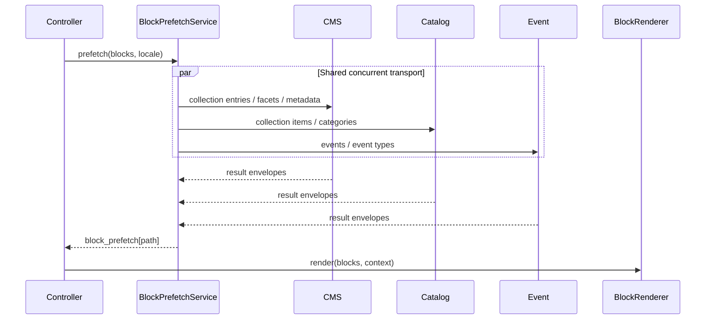

# Block prefetch contract

`BlockPrefetchService` is the single composition boundary for remote data used
by dynamic collection blocks. It runs after CMS page resolution and before
`BlockRenderer`; ViewModels only normalize the result and do not open remote
requests during rendering.

## Flow



The result is keyed by the stable block path (`0`, `1`, `2.0`, …). Every
dynamic block receives an envelope, including failures:

```php
[
    'ok' => true,
    'status' => 200,
    'data' => [...],
    'meta' => ['pagination' => [...]],
    'facets' => ['categories' => [...], 'tags' => [...]],
    'collection' => null,
    'stale' => false,
    'messages' => [],
]
```

## Supported blocks and ownership

- `collection_grid`, `collection_listing`, and `collection_timeline` are
  planned from `source_type` and use the owning CMS, Catalog, or Event client.
- `event_item_*` and `catalog_item_*` detail blocks are planned by their slug
  or ID and receive the union of fields needed by the detail ViewModels.
- Explicit `source_type` wins. `auto` recognizes the established aliases for
  events and catalog; an unknown key defaults to CMS and writes a diagnostic.

`collection_listing` includes the current request state (`page`, `per_page`,
search, filters, tag/category, and public ordering), its configured sparse
projection, pagination metadata, and requested facets. Preview credentials are
forwarded opaquely into the request identity and use `cacheTtl = 0`, so preview
responses never enter the public cache.

## Batching and failure policy

The planner deduplicates exact `(client, scope, path, locale, normalized query)`
requests while preserving different pages, filters, limits, and projections.
Native `WebApiClient` instances use one shared `curl_multi` batch across their
different base URLs. Each client still owns its API key, timeout, cache, stale
policy, and telemetry.

Successful responses are cached normally. Transport failures and 5xx responses
may use the client's stale result; 4xx responses remain authoritative. A
failed or missing result is rendered as an empty/preview state and is never
retried by a ViewModel.

`LayoutDataPrefetchService` remains a separate layout concern, but it completes
alongside block prefetch before the public view is evaluated.

See [ADR 0003](adr/0003-single-block-prefetch-before-render.md) for the accepted
architecture decision and [CONTEXT.md](../CONTEXT.md) for the project glossary.
